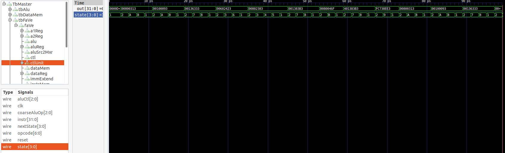

# FaVe
risc-v multi-cycle simulator written in System Verilog
named afer Faye Valentine from Cowboy Bebop


# To build

```
make
```

It runs testbench that executes next program for several cycles (it's inifinity loop)

```
    addi x6, x0, 8
    addi x1, x0, 1
    or x6, x6, x1
    sw x6, 8(x0)
    lw x7, 8(x0)
    add x7, x7, x1
    jal x8, 8
    add x7, x7, x1
    sub x7, x7, x1
    beq x7, x7, -36
```

In folder "waves" wavefronts are stored.
You can explore them with gtkwave:
```
    gtkwave wavefront.vcd 
```



# Dependency:

To run FaVe it you will need [verilator](https://github.com/verilator/verilator),
it creates launchable C++ model of cpu described with verilog.

My version: "Verilator 5.036 2025-04-27 rev v5.036-48-g0dc93c1d5"

# Usefull links

CPU design is taken from: Harris & Harris: Digital Design and Computer Architecture - RISCV Edition
To easily get instruction in hex format: https://luplab.gitlab.io/rvcodecjs/
To execute riscv code step-by-step: https://www.cs.cornell.edu/courses/cs3410/2019sp/riscv/interpreter/
